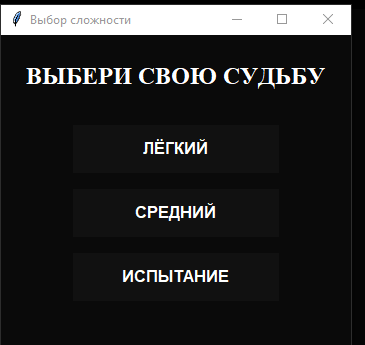
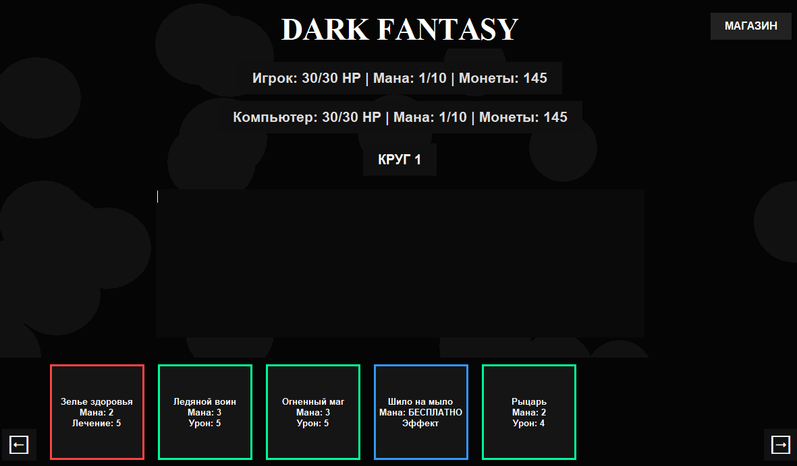
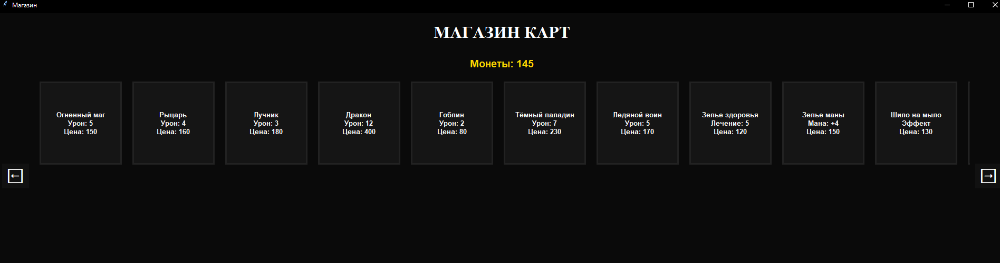

# Dark Fantasy — Card Game

Карточная игра в стиле dark fantasy на Python и **PyQt6**. Сражайтесь с компьютером, собирайте колоду, покупайте карты в магазине и используйте уникальные эффекты.

**Автор:** Груздев Николай Максимович  
**Репозиторий:** [github.com/1DARKle1/my_first_game](https://github.com/1DARKle1/my_first_game)

## Скриншоты

| Меню | Игра | Магазин |
|------|------|---------|
|  |  |  |

## Быстрый старт (Windows)

1. Откройте [Releases](https://github.com/1DARKle1/my_first_game/releases).
2. Скачайте **`DarkFantasyCardGame.exe`** из релиза **Card fantasi**.
3. Запустите файл — установка не требуется.

> При первом запуске `.exe` рядом может появиться папка `DarkFantasyData` — это служебные данные игры.

## Запуск из исходников

**Требования:** Python 3.10+, Windows 10/11

```bash
pip install -r requirements.txt
python main.py
```

## Сборка `.exe` самостоятельно

```bash
pip install -r requirements.txt
pyinstaller --noconfirm --windowed --onefile --name DarkFantasyCardGame --add-data "assets;assets" --hidden-import PyQt6.QtMultimedia main.py
```

Готовый файл: `dist/DarkFantasyCardGame.exe`

## Возможности

- 3 уровня сложности
- 12 карт с уникальным артом и эффектами
- HP, мана, золото и магазин карт
- Звуковые эффекты и анимации (полёт карты, вспышки, частицы)
- Журнал боя в реальном времени

## Карты

| Тип | Примеры |
|-----|---------|
| Атака | Огненный маг, Рыцарь, Дракон, Гоблин… |
| Лечение | Зелье здоровья, Признание богов, Последний шанс |
| Мана / особые | Зелье маны, Шило на мыло |

## Структура проекта

```text
main.py        — игра (PyQt6)
cards.py       — карты и игрок
design.py      — тема, рендер карт, ассеты
sounds.py      — звуковые эффекты
paths.py       — пути для .exe и исходников
assets/        — фон, иконки, арт карт, звуки
screenshots/   — скриншоты для README
```

## Технологии

- Python 3
- PyQt6
- Pillow
- PyInstaller

## Лицензия

Учебный проект. Свободное использование с указанием автора.
